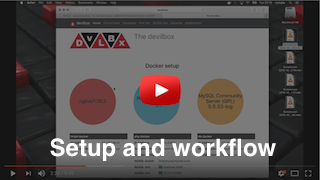
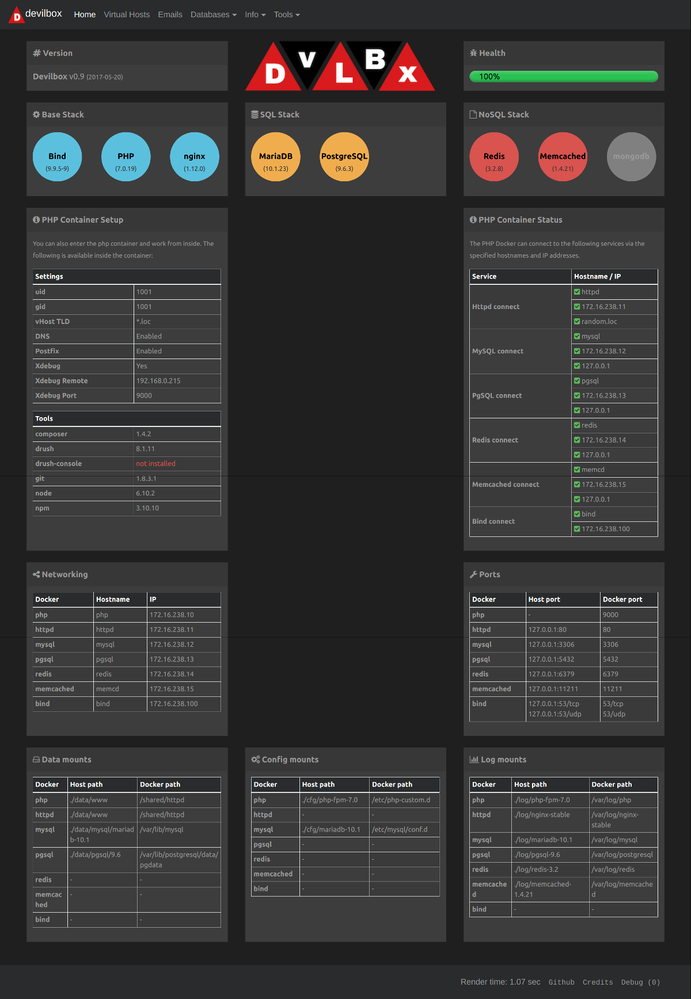
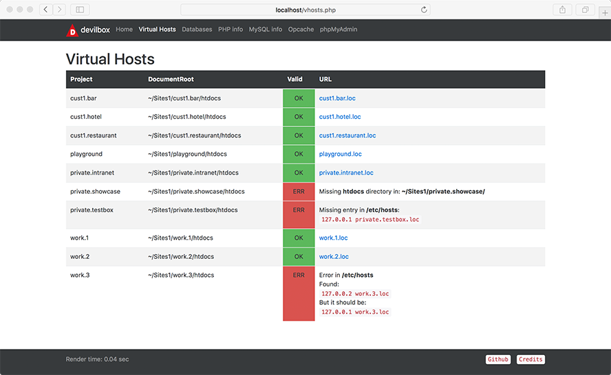
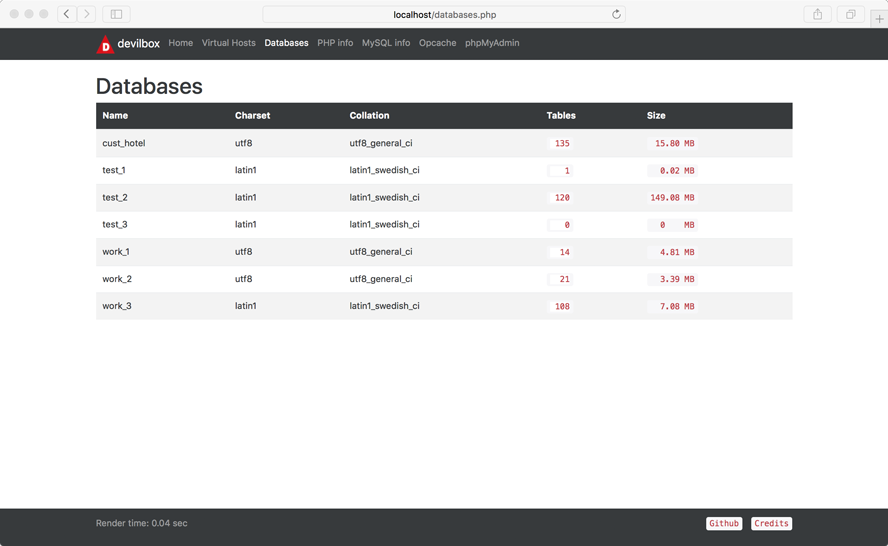
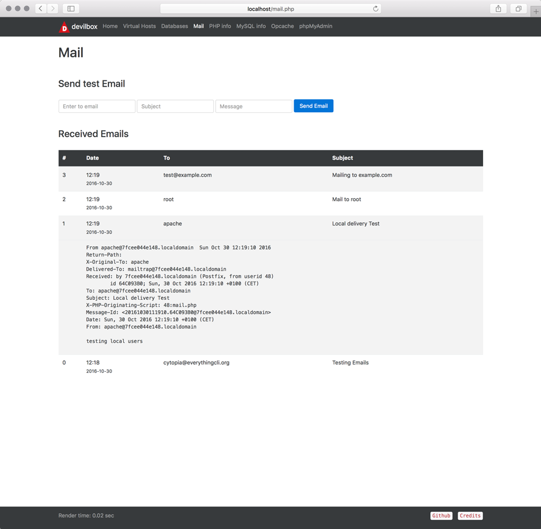

#  The devilbox


[Usage](#usage) |
[Features](#feature-overview) |
[Documentation](#documentation) |
[Run-time Matrix](#run-time-matrix) |
[Intranet](#intranet-overview) |
[Screenshots](#screenshots) |
[License](#license) |
[Contributing](#contributing) |


[](https://travis-ci.org/cytopia/devilbox)  [](https://www.docker.com/) [](https://opensource.org/licenses/MIT)

The devilbox is a modern and highly customizable alternative for *[XAMPP](https://www.apachefriends.org)* with a few additional feature on top. It is based on `docker-compose` with presets for all kinds of versions for webservers, database servers, php and more.

Configuration is not necessary, as everything is pre-setup with mass virtual hosting and auto-dns.

**Supported operating systems**

  

<sub>It might run on FreeBSD, but I don't know the status of docker-compose there.</sub>


---

## Usage

### Quick start

You are up and running in three simple steps:

```shell
# Create docker-compose environment file
$ cp env-example .env

# Edit your configuration
$ vim .env

# Start all containers
$ docker-compose up
```

### Selective start

The above will start all containers, you can however also just start the containers you actually need. This is achieved by simply specifying them in the docker-compose command. Here are a few examples to get you started.

```shell
$ docker-compose up httpd php mysql redis
```


```shell
$ docker-compose up httpd php mysql pgsql redis memcd
```


```shell
$ docker-compose up httpd php pgsql memcd
```


### Run different versions

Every single attachable container comes with many different versions (see **[runtime-matrix](#run-time-matrix)** below). In order to select the desired version for a container, simply edit the `.env` file and uncomment the version of choice.

The following example shows how to set Memcached to version `1.4.28`:
```shell
$ vim .env

...
#MEMCD_SERVER=1.4.21
#MEMCD_SERVER=1.4.22
#MEMCD_SERVER=1.4.23
#MEMCD_SERVER=1.4.24
#MEMCD_SERVER=1.4.25
#MEMCD_SERVER=1.4.26
#MEMCD_SERVER=1.4.27
MEMCD_SERVER=1.4.28
#MEMCD_SERVER=1.4.29
#MEMCD_SERVER=1.4.30
#MEMCD_SERVER=1.4.31
#MEMCD_SERVER=1.4.32
#MEMCD_SERVER=1.4.33
#MEMCD_SERVER=1.4.34
#MEMCD_SERVER=1.4.35
#MEMCD_SERVER=1.4.36
#MEMCD_SERVER=latest
```

### Enter the container

You can also work directly inside the php container if you need to run tools such as `drush`, `drupal-console`, `composer`, `node` etc. Simply use the prepared scripts in the base directory to enter:
```shell
# Enter as user devilbox (normal operation / development)
$ ./bash.sh

# Enter as root user (do root stuff)
$ ./root_bash.sh
```

Your projects can be found in `/shared/httpd`. DNS records are automatically available inside the php container. Also every other service will be available on `127.0.0.1` inside the php container (tricky socat port-forwarding).


## Feature overview

The devilbox has everything setup for you. The only thing you will have to install is `docker` and `docker-compose`. Virtual hosts and DNS entries will be created automatically, just by adding new project folders.

* **Mass virtual host**
* **Custom domains** (`*.loc`, `*.local`, `*.dev`, ...)
* **Auto-DNS** (Internal Bind server running)
* **Email catch-all** (Internal postfix with catch-all)
* **Log files** (available on host computer)
* **Config overwrites** (`my.cnf`, `nginx.conf`, `httpd.conf` or `php.ini`)
* **Tools** (git, composer, node, npm, drush, drupal-console, ...)
* **Xdebug**

**Batteries included:**

* [phpMyAdmin](https://www.phpmyadmin.net)
* [Adminer](https://www.adminer.org)
* [OpcacheGUI](https://github.com/PeeHaa/OpCacheGUI)
* Mail viewer


## Documentation

### Video Tutorials

[](https://www.youtube.com/watch?v=reyZMyt2Zzo) 
[](https://www.youtube.com/watch?v=e-U-C5WhxGY)

### Documentation

For setup, usage and examples see detailed **[Documentation](doc/README.md)**.

## Run-time Matrix

Select your prefered version. (By editing the **`.env`** file)

No need to install and configure different versions locally. Simply choose your required LAMP/LEMP stack versions during startup and it is up and running instantly.

#### 1/3 Base stack (required)

| DNS | Webserver | PHP |
|-----|-----------|-----|
| [](https://travis-ci.org/cytopia/docker-bind) [Bind](https://github.com/cytopia/docker-bind)  | [](https://travis-ci.org/cytopia/docker-apache-2.2) [Apache 2.2](https://github.com/cytopia/docker-apache-2.2) | [](https://travis-ci.org/cytopia/docker-php-fpm-5.4) [PHP 5.4](https://github.com/cytopia/docker-php-fpm-5.4) |
|     | [](https://travis-ci.org/cytopia/docker-apache-2.4) [Apache 2.4](https://github.com/cytopia/docker-apache-2.4) | [](https://travis-ci.org/cytopia/docker-php-fpm-5.5) [PHP 5.5](https://github.com/cytopia/docker-php-fpm-5.5) |
|     | [](https://travis-ci.org/cytopia/docker-nginx-stable) [Nginx stable](https://github.com/cytopia/docker-nginx-stable) | [](https://travis-ci.org/cytopia/docker-php-fpm-5.6) [PHP 5.6](https://github.com/cytopia/docker-php-fpm-5.6) |
|     | [](https://travis-ci.org/cytopia/docker-nginx-mainline) [Nginx mainline](https://github.com/cytopia/docker-nginx-mainline) | [](https://travis-ci.org/cytopia/docker-php-fpm-7.0) [PHP 7.0](https://github.com/cytopia/docker-php-fpm-7.0) |
|     | | [](https://travis-ci.org/cytopia/docker-php-fpm-7.1) [PHP 7.1](https://github.com/cytopia/docker-php-fpm-7.1) |
|     | | [](https://travis-ci.org/cytopia/docker-hhvm-latest) [HHVM latest](https://github.com/cytopia/docker-hhvm-latest)

<sub>**Note:** Entries without links or without build-status are planned, but not yet available. See [ROADMAP](https://github.com/cytopia/devilbox/issues/23) for tasks and upcoming features.</sub>

#### 2/3 SQL stack (optional)

| MySQL | PostgreSQL | MS SQL |
|-------|------------|--------|
| [](https://travis-ci.org/cytopia/docker-mysql-5.5) [MySQL 5.5](https://github.com/cytopia/docker-mysql-5.5) | [](https://travis-ci.org/docker-library/postgres/branches) [PgSQL 9.1](https://hub.docker.com/_/postgres/) | MS SQL 2017 |
| [](https://travis-ci.org/cytopia/docker-mysql-5.6) [MySQL 5.6](https://github.com/cytopia/docker-mysql-5.6) | [](https://travis-ci.org/docker-library/postgres/branches) [PgSQL 9.2](https://hub.docker.com/_/postgres/) | |
| [](https://travis-ci.org/cytopia/docker-mysql-5.7) [MySQL 5.7](https://github.com/cytopia/docker-mysql-5.7) | [](https://travis-ci.org/docker-library/postgres/branches) [PgSQL 9.3](https://hub.docker.com/_/postgres/) | |
| [](https://travis-ci.org/cytopia/docker-mysql-8.0) [MySQL 8.0](https://github.com/cytopia/docker-mysql-8.0)  | [](https://travis-ci.org/docker-library/postgres/branches) [PgSQL 9.4](https://hub.docker.com/_/postgres/) | |
| [](https://travis-ci.org/cytopia/docker-mariadb-5.5) [MariaDB 5.5](https://github.com/cytopia/docker-mariadb-5.5) | [](https://travis-ci.org/docker-library/postgres/branches) [PgSQL 9.5](https://hub.docker.com/_/postgres/) | |
| [](https://travis-ci.org/cytopia/docker-mariadb-10.0) [MariaDB 10.0](https://github.com/cytopia/docker-mariadb-10.0) | [](https://travis-ci.org/docker-library/postgres/branches) [PgSQL 9.6](https://hub.docker.com/_/postgres/) | |
| [](https://travis-ci.org/cytopia/docker-mariadb-10.1) [MariaDB 10.1](https://github.com/cytopia/docker-mariadb-10.1) | | |
| [](https://travis-ci.org/cytopia/docker-mariadb-10.2) [MariaDB 10.2](https://github.com/cytopia/docker-mariadb-10.2) | | |
| [](https://travis-ci.org/cytopia/docker-mariadb-10.3) [MariaDB 10.3](https://github.com/cytopia/docker-mariadb-10.3) | | |

<sub>**Note:** Entries without links or without build-status are planned, but not yet available. See [ROADMAP](https://github.com/cytopia/devilbox/issues/23) for tasks and upcoming features.</sub>

#### 3/3 NoSQL stack (optional)

| Cassandra | CouchDB | Memcached | MongoDB | Redis |
|-----------|---------|-----------|---------|-------|
| Cassandra 2.1 | CouchDB 1.6 | [](https://travis-ci.org/docker-library/memcached/branches) Memcached latest | MongoDB 2.6 | [](https://travis-ci.org/docker-library/redis/branches) [Redis 2.8](https://github.com/docker-library/redis) |
| Cassandra 2.2 | CouchDB 2.0 |                  | MongoDB 3.0 | [](https://travis-ci.org/docker-library/redis/branches) [Redis 3.0](https://github.com/docker-library/redis) |
| Cassandra 3.0 |             |                  | MongoDB 3.2 | [](https://travis-ci.org/docker-library/redis/branches) [Redis 3.2](https://github.com/docker-library/redis) |
|               |             |                  | MongoDB 3.4 | |

<sub>**Note:** Entries without links or without build-status are planned, but not yet available. See [ROADMAP](https://github.com/cytopia/devilbox/issues/23) for tasks and upcoming features.</sub>


<!--
**Optional search stack**

| Apache Solr | Elasticsearch |
|-------------|---------------|
| todo        |               |
-->
<!--
**Optional cgi stack**

| Go   | Perl | Python | Ruby |
|------|------|--------|------|
| todo | todo | todo   | todo |
-->


<!--
## Documentation

* Configuration
* Xdebug
-->

## Intranet overview

The devilbox comes with a pre-configured intranet on `http://localhost`. It will not only show you, your chosen configuration, but also validate the status of your configuration, such as *Do DNS records exists (on host and container)*, *are directories properly set-up*. Additionally it provides external tools to let you interact with databases and emails.

* **Virtual Host overview** (validates directories and DNS)
* **Database overview** (MySQL, PgSQL, Redis, Memcache, ...)
* **Email overview**
* **Info pages** (Httpd, MySQL, PgSQL, Redis, Memcache, ...)
* **[phpMyAdmin](https://www.phpmyadmin.net)**
* **[Adminer](https://www.adminer.org)**
* **[OpcacheGUI](https://github.com/PeeHaa/OpCacheGUI)**


## Screenshots

### Homepage with host / docker information

The homepage shows you the status of your current configured setup.

* which versions are used
* what directories are mounted
* where does DNS point to
* what other settings have been set
* did any errors occur?




### Virtual Host overview

This overview shows you all available virtual hosts and if they need additional configuration (on the host)

Virtual Hosts are considered valid if the following requirements are met (on the host system):

* `htdocs` folder/symlink exists in your project folder
* `/etc/hosts` has a valid DNS config for your host: `127.0.0.1  <project-folder>.<TLD_SUFFIX>` (alternatively the bundle BIND server can be attached to your host-computer).



### Database overview

Shows you all the databases that are loaded




### Email overview

Shows you all the emails that have been sent. No email will actually be sent outside, but they are all catched by one account and presented here.




## License

[MIT License](LICENSE.md)


## Contributing

There is quite a lot todo and planned. If you like to contribute, view [CONTRIBUTING.md](CONTRIBUTING.md) and [ROADMAP](https://github.com/cytopia/devilbox/issues/23).

Contributors will be credited within the intranet and on the github page.

